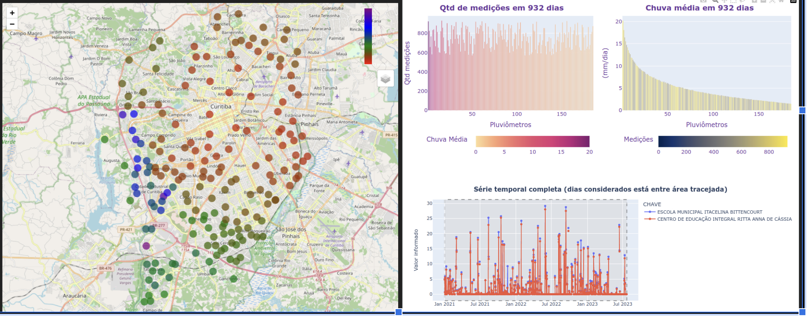
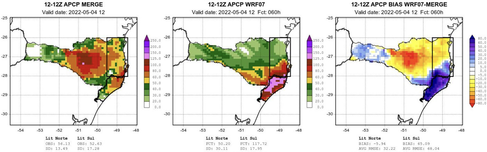
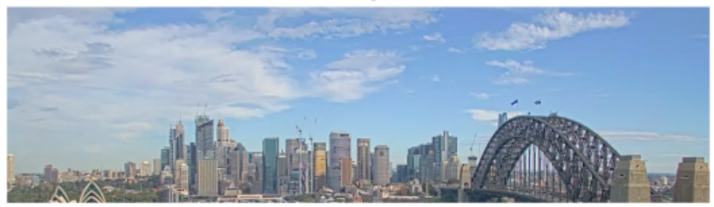
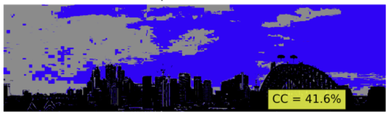
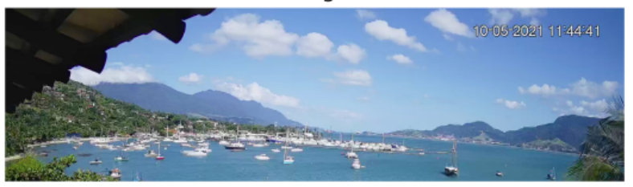
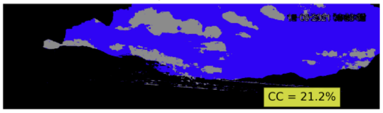

<!-- BEGIN OF COMMENTS
https://www.markdownguide.org/
https://www.markdownguide.org/cheat-sheet
https://icons-for-free.com/
Boeing, G. 2017. OSMnx: New Methods for Acquiring, Constructing, Analyzing, and Visualizing Complex Street Networks. Computers, Environment and Urban Systems 65, 126-139.
This is a landing page
END OF COMMENTS -->

<table>
   <tr>
      <td width="60%" align="justify">
         <h2> My self</h2>
         <h4>I'm a Brazilian citizen that works at the Brazilian National Institute for Space Research (INPE). I love applying science and technology to solve environmental problems in order to save lives, care for planet Earth and minimize economic damage.</h4>
      

         &nbsp;
         &nbsp;
         &nbsp;
         
         <!-- |  -->
      

      </td>
      <td>
         <embed type="text/html" src="assets/INPE.html" width="450" height="400" align="right">
      </td>
   </tr>
</table>

---
## Skills 

<table>
   <tr>
      <td><ul><li>Artificial Intelligence</li><li>Computer Vision</li><li>Computer Programming</li></ul></td>
      <td><ul><li>Data Base Management Systems</li><li>Web Automation</li><li>AI/IT Project Management</li></ul></td>
      <td><ul><li>Geo Processing</li><li>Shell Programming</li><li>Dashboard Applications</li></ul></td>
   </tr>
</table>
  
---
## Projects

<table>
   <tr><td>
      <h3 style="color:blue"><b><li>SCIENCE IN SCHOOL</li></b></h3>
      
Engage children in science through their participation in the creation of a network of low-cost rain gauges made by themselves, with subsequent data manipulation and visualization on a dashboard and a map in the internet.

       
   </td></tr>

   <tr><td>
      <h3 style="color:blue"><b><li><a href="https://ai-sismom.github.io/">AI applied for SisMOM - Monitoring Oil Spills in de Ocean</a></li></b></h3>
      

       
   </td></tr>

   <tr><td>
      <h3 style="color:blue"><b><li>ARTIFICIAL INTELLIGENCE AND EARTH SYSTEM MODELING TOWARD DIRECTION OF EXTREME CLIMATE EVENTS IN THE BRICS</li></b></h3>
   </td></tr>

   <tr><td>
      <h3 style="color:blue"><b><li>COMBINING CLIMATE NUMERICAL MODELING AND ML USE IN DETECTING CLIMATE EXTREMES IN SUB SEASONAL, SEASONAL AND MULTI-DECADAL HORIZONS</li></b></h3>
      
KEYWORDS: Climate forecast, AI/ML, Floods, Droughts, Heat Waves, Madeira river, Paraná river, São Francisco river

   </td></tr>

   <tr><td>
      <h3 style="color:blue"><b><li>SYNOPTIC ANALYSIS OF EXTREME WEATHER EVENTS IN SOUTHERN BRAZIL</li></b></h3>
      

   </td></tr>
</table>
   
---
## Awards
<h3 style="color:blue"><b>3rd Place in <a href="https://community.wmo.int/en/wgfvrhiweatherwinners-2nd-international-verification-challenge-best-new-verification-metric-making-use-non-traditional-observations">Challenge: Best New Forecast Verification Approach Using Non-Traditional Observations</a></b> Promoted by: <a href="https://community.wmo.int/en/activity-areas/wwrp">World Weather Research Programme (WWRP/WMO)</a></h3>

<h3 style="color:blue">Title: <b>CLOUD COVERAGE ESTIMATION USING WEBCAMS</b></h3>

| Original photo | Random Forest estimation |
|:-:|:-:|
|  |  |
|  |  |

---
## Education
* **Doctoral degree** at INPE/BR: Theme: Applying Neural networks to calibrate a global ensemble Numerical Weather Prediction system
* **Master degree** at INPE/BR: Theme: Building a semi-automatic database persistence layer

---
## Personal interests
* **Sports**: Soccer, Weight trainning, Surfing, Paragliding, Running, Hiking, Cycling
* **Traveling**: Patagônia, Europe, USA, South America, ... and around the world.
  
